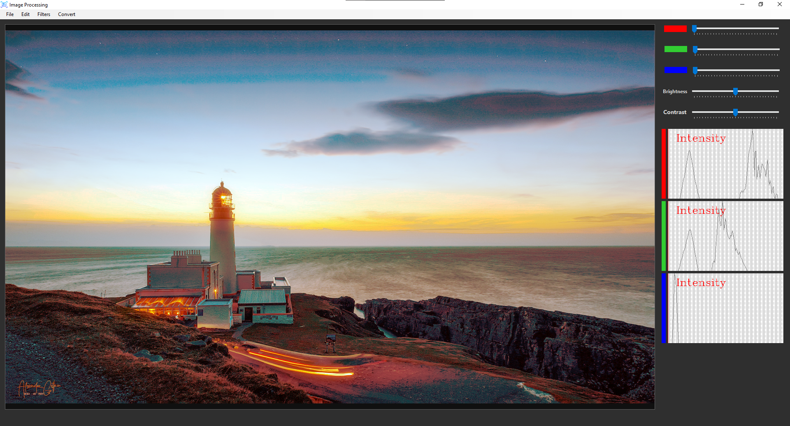

# Image Proccesing Windows Desktop Form App

## Packages: AForge & Emgu.CV

### Features
* Gray Filter
* Sharpen
* Contrast 
* Blur Filter
* Edge Determination.
* Histogram Equalization
* Converting Binary
* Dilation
* Erosion
* R,G,B Adjustments

## Screenshot

